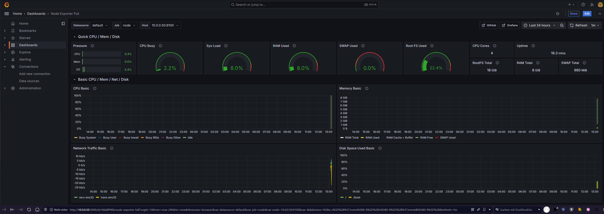
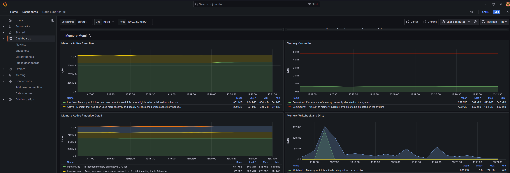

# Mail & Media technical interview
## Repo for the technical interview
### Preconditions
I used Debian 12 VM on host 10.0.0.50 \
Installed following packages beforehand:
 - python3
 - ansible
 - ssh-server
 - vim

Ansible is configured by ```ansible.cfg``` from my git-repository

The target system 10.0.0.49 needs to have installed:
  - python3
  - ansible
  - ssh-server

Assuming, that the VM is reachable via SSH and passwordless authentication with keys was already configured.

How to run the playbook, run:
```
ansible-playbook install-playbook.yml  
```

# Grafana and Prometheus node_exporter
I configured a Grafana dashboard, using the metrics that come from the installed node_exporter.




